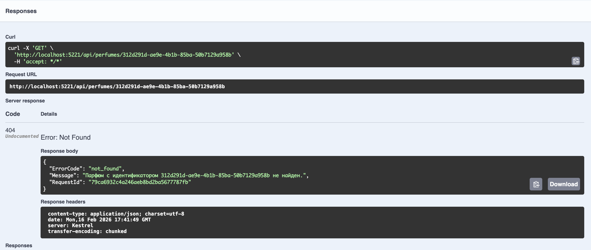
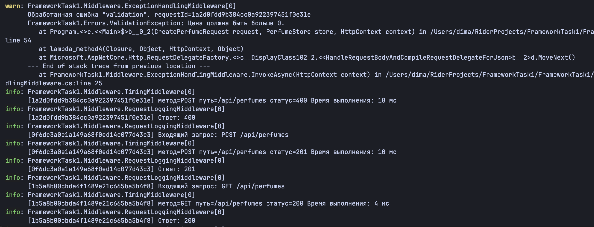

# Мини веб служба и конвейер обработки запросов
## Тема: реестр парфюмерии
Практическое задание 1, Технологии разработки приложений на базе фреймворков

## Было реализовано:
1. Точка доступа для создания объекта парфюмерии
   
2. Точка доступа для получения парфюмерии по идентификатору
   
3. Точка доступа для получения списка объектов парфюмерии
   
   
4. Единый обработчик ошибок
   
   
5. Обработчик для логирования запроса, времени выполнения запроса и идентификатора запроса
   
   В квадратных скобках пишется уникальный ID запроса. 